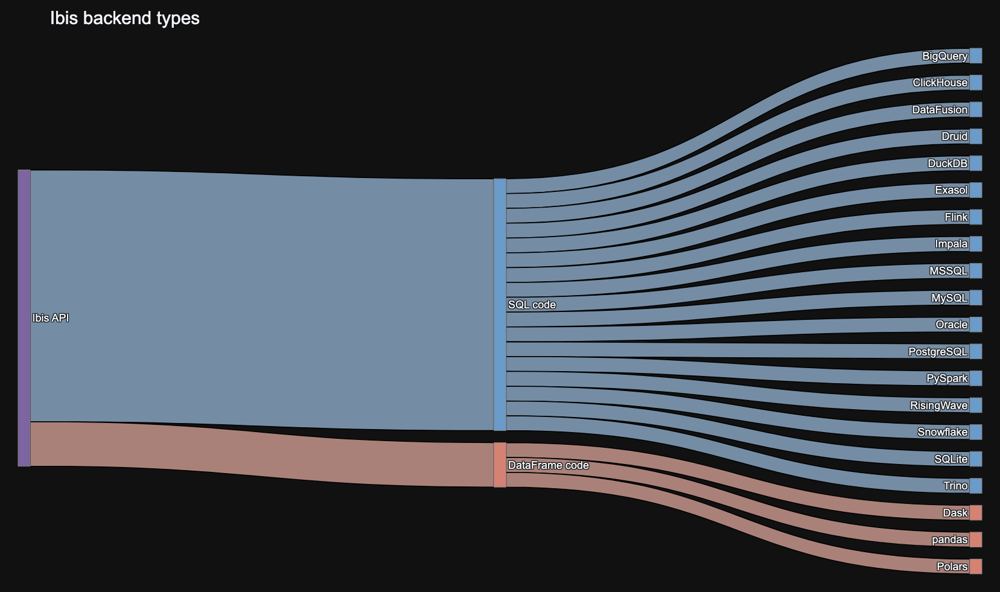

# Ibis

[](http://ibis-project.org)
[](https://ibis-project.zulipchat.com)
[](https://anaconda.org/conda-forge/ibis-framework)
[](https://pypi.org/project/ibis-framework)
[](https://github.com/ibis-project/ibis/actions/workflows/ibis-main.yml?query=branch%3Amain)
[](https://github.com/ibis-project/ibis/actions/workflows/ibis-backends.yml?query=branch%3Amain)
[](https://codecov.io/gh/ibis-project/ibis)

## What is Ibis?

Ibis is the portable Python dataframe library:

- Fast local dataframes (via DuckDB by default)
- Lazy dataframe expressions
- Interactive mode for iterative data exploration
- [Compose Python dataframe and SQL code](#python--sql-better-together)
- Use the same dataframe API for [nearly 20 backends](#backends)
- Iterate locally and deploy remotely by [changing a single line of code](#portability)

See the documentation on ["Why Ibis?"](https://ibis-project.org/why) to learn more.

## Getting started

You can `pip install` Ibis with a backend and example data:

```bash
pip install 'ibis-framework[duckdb,examples]'
```

> 💡 **Tip**
>
> See the [installation guide](https://ibis-project.org/install) for more installation options.

Then use Ibis:

```python
>>> import ibis
>>> ibis.options.interactive = True
>>> t = ibis.examples.penguins.fetch()
>>> t
┏━━━━━━━━━┳━━━━━━━━━━━┳━━━━━━━━━━━━━━━━┳━━━━━━━━━━━━━━━┳━━━━━━━━━━━━━━━━━━━┳━━━━━━━━━━━━━┳━━━━━━━━┳━━━━━━━┓
┃ species ┃ island    ┃ bill_length_mm ┃ bill_depth_mm ┃ flipper_length_mm ┃ body_mass_g ┃ sex    ┃ year  ┃
┡━━━━━━━━━╇━━━━━━━━━━━╇━━━━━━━━━━━━━━━━╇━━━━━━━━━━━━━━━╇━━━━━━━━━━━━━━━━━━━╇━━━━━━━━━━━━━╇━━━━━━━━╇━━━━━━━┩
│ string  │ string    │ float64        │ float64       │ int64             │ int64       │ string │ int64 │
├─────────┼───────────┼────────────────┼───────────────┼───────────────────┼─────────────┼────────┼───────┤
│ Adelie  │ Torgersen │           39.1 │          18.7 │               181 │        3750 │ male   │  2007 │
│ Adelie  │ Torgersen │           39.5 │          17.4 │               186 │        3800 │ female │  2007 │
│ Adelie  │ Torgersen │           40.3 │          18.0 │               195 │        3250 │ female │  2007 │
│ Adelie  │ Torgersen │           NULL │          NULL │              NULL │        NULL │ NULL   │  2007 │
│ Adelie  │ Torgersen │           36.7 │          19.3 │               193 │        3450 │ female │  2007 │
│ Adelie  │ Torgersen │           39.3 │          20.6 │               190 │        3650 │ male   │  2007 │
│ Adelie  │ Torgersen │           38.9 │          17.8 │               181 │        3625 │ female │  2007 │
│ Adelie  │ Torgersen │           39.2 │          19.6 │               195 │        4675 │ male   │  2007 │
│ Adelie  │ Torgersen │           34.1 │          18.1 │               193 │        3475 │ NULL   │  2007 │
│ Adelie  │ Torgersen │           42.0 │          20.2 │               190 │        4250 │ NULL   │  2007 │
│ …       │ …         │              … │             … │                 … │           … │ …      │     … │
└─────────┴───────────┴────────────────┴───────────────┴───────────────────┴─────────────┴────────┴───────┘
>>> g = t.group_by("species", "island").agg(count=t.count()).order_by("count")
>>> g
┏━━━━━━━━━━━┳━━━━━━━━━━━┳━━━━━━━┓
┃ species   ┃ island    ┃ count ┃
┡━━━━━━━━━━━╇━━━━━━━━━━━╇━━━━━━━┩
│ string    │ string    │ int64 │
├───────────┼───────────┼───────┤
│ Adelie    │ Biscoe    │    44 │
│ Adelie    │ Torgersen │    52 │
│ Adelie    │ Dream     │    56 │
│ Chinstrap │ Dream     │    68 │
│ Gentoo    │ Biscoe    │   124 │
└───────────┴───────────┴───────┘
```

> 💡 **Tip**
>
> See the [getting started tutorial](https://ibis-project.org/tutorials/getting_started) for a full introduction to Ibis.

## Python + SQL: better together

For most backends, Ibis works by compiling its dataframe expressions into SQL:

```python
>>> ibis.to_sql(g)
SELECT
  "t1"."species",
  "t1"."island",
  "t1"."count"
FROM (
  SELECT
    "t0"."species",
    "t0"."island",
    COUNT(*) AS "count"
  FROM "penguins" AS "t0"
  GROUP BY
    1,
    2
) AS "t1"
ORDER BY
  "t1"."count" ASC
```

You can mix SQL and Python code:

```python
>>> a = t.sql("SELECT species, island, count(*) AS count FROM penguins GROUP BY 1, 2")
>>> a
┏━━━━━━━━━━━┳━━━━━━━━━━━┳━━━━━━━┓
┃ species   ┃ island    ┃ count ┃
┡━━━━━━━━━━━╇━━━━━━━━━━━╇━━━━━━━┩
│ string    │ string    │ int64 │
├───────────┼───────────┼───────┤
│ Adelie    │ Torgersen │    52 │
│ Adelie    │ Biscoe    │    44 │
│ Adelie    │ Dream     │    56 │
│ Gentoo    │ Biscoe    │   124 │
│ Chinstrap │ Dream     │    68 │
└───────────┴───────────┴───────┘
>>> b = a.order_by("count")
>>> b
┏━━━━━━━━━━━┳━━━━━━━━━━━┳━━━━━━━┓
┃ species   ┃ island    ┃ count ┃
┡━━━━━━━━━━━╇━━━━━━━━━━━╇━━━━━━━┩
│ string    │ string    │ int64 │
├───────────┼───────────┼───────┤
│ Adelie    │ Biscoe    │    44 │
│ Adelie    │ Torgersen │    52 │
│ Adelie    │ Dream     │    56 │
│ Chinstrap │ Dream     │    68 │
│ Gentoo    │ Biscoe    │   124 │
└───────────┴───────────┴───────┘
```

This allows you to combine the flexibility of Python with the scale and performance of modern SQL.

## Backends

Ibis supports nearly 20 backends:

- [Apache DataFusion](https://ibis-project.org/backends/datafusion/)
- [Apache Druid](https://ibis-project.org/backends/druid/)
- [Apache Flink](https://ibis-project.org/backends/flink)
- [Apache Impala](https://ibis-project.org/backends/impala/)
- [Apache PySpark](https://ibis-project.org/backends/pyspark/)
- [BigQuery](https://ibis-project.org/backends/bigquery/)
- [ClickHouse](https://ibis-project.org/backends/clickhouse/)
- [DuckDB](https://ibis-project.org/backends/duckdb/)
- [Exasol](https://ibis-project.org/backends/exasol)
- [MySQL](https://ibis-project.org/backends/mysql/)
- [Oracle](https://ibis-project.org/backends/oracle/)
- [Polars](https://ibis-project.org/backends/polars/)
- [PostgreSQL](https://ibis-project.org/backends/postgresql/)
- [RisingWave](https://ibis-project.org/backends/risingwave/)
- [SQL Server](https://ibis-project.org/backends/mssql/)
- [SQLite](https://ibis-project.org/backends/sqlite/)
- [Snowflake](https://ibis-project.org/backends/snowflake)
- [Trino](https://ibis-project.org/backends/trino/)

## How it works

Most Python dataframes are tightly coupled to their execution engine. And many databases only support SQL, with no Python API. Ibis solves this problem by providing a common API for data manipulation in Python, and compiling that API into the backend’s native language. This means you can learn a single API and use it across any supported backend (execution engine).

Ibis broadly supports two types of backend:

1. SQL-generating backends
2. DataFrame-generating backends



## Portability

To use different backends, you can set the backend Ibis uses:

```python
>>> ibis.set_backend("duckdb")
>>> ibis.set_backend("polars")
>>> ibis.set_backend("datafusion")
```

Typically, you'll create a connection object:

```python
>>> con = ibis.duckdb.connect()
>>> con = ibis.polars.connect()
>>> con = ibis.datafusion.connect()
```

And work with tables in that backend:

```python
>>> con.list_tables()
['penguins']
>>> t = con.table("penguins")
```

You can also read from common file formats like CSV or Apache Parquet:

```python
>>> t = con.read_csv("penguins.csv")
>>> t = con.read_parquet("penguins.parquet")
```

This allows you to iterate locally and deploy remotely by changing a single line of code.

> 💡 **Tip**
>
> Check out [the blog on backend agnostic arrays](https://ibis-project.org/posts/backend-agnostic-arrays/) for one example using the same code across DuckDB and BigQuery.

## Community and contributing

Ibis is an open source project and welcomes contributions from anyone in the community.

- Read [the contributing guide](https://github.com/ibis-project/ibis/blob/main/docs/CONTRIBUTING.md).
- We care about keeping the community welcoming for all. Check out [the code of conduct](https://github.com/ibis-project/ibis/blob/main/CODE_OF_CONDUCT.md).
- The Ibis project is open sourced under the [Apache License](https://github.com/ibis-project/ibis/blob/main/LICENSE.txt).

Join our community by interacting on GitHub or chatting with us on [Zulip](https://ibis-project.zulipchat.com/).

For more information visit https://ibis-project.org/.

## Governance

The Ibis project is an [independently governed](https://github.com/ibis-project/governance/blob/main/governance.md) open source community project to build and maintain the portable Python dataframe library. Ibis has contributors across a range of data companies and institutions.
