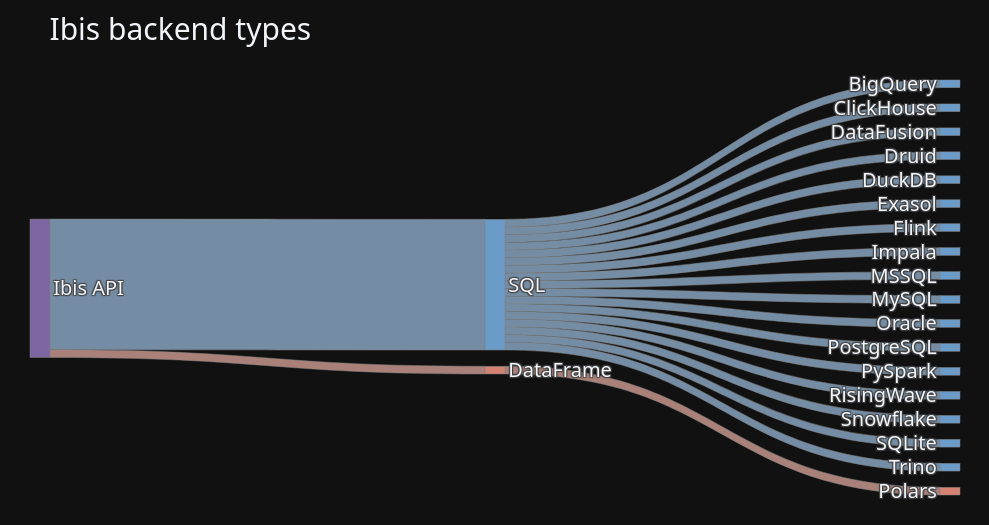

# Ibis

[](http://ibis-project.org)
[](https://ibis-project.zulipchat.com)
[](https://anaconda.org/conda-forge/ibis-framework)
[](https://pypi.org/project/ibis-framework)
[](https://github.com/ibis-project/ibis/actions/workflows/ibis-main.yml?query=branch%3Amain)
[](https://github.com/ibis-project/ibis/actions/workflows/ibis-backends.yml?query=branch%3Amain)
[](https://codecov.io/gh/ibis-project/ibis)

## What is Ibis?

Ibis is the portable Python dataframe library designed to bring the familiarity of pandas-like operations to various data backends, from local files to distributed databases. It allows you to express data transformations in Python and then execute them efficiently on your chosen backend without writing backend-specific SQL.

### Key Features:

-   **Backend Agnostic:** Use the same Python dataframe API for nearly 20 different backends, including DuckDB, Snowflake, BigQuery, and many more.
-   **Lazy Evaluation:** Build complex queries as lazy expressions, which are optimized and compiled to efficient SQL (or other native operations) only when you explicitly `execute` them.
-   **Fast Local Dataframes:** Get started quickly with DuckDB as the default high-performance local backend.
-   **Interactive Data Exploration:** Leverage interactive mode for rapid, iterative data analysis.
-   **Python + SQL Synergy:** Seamlessly compose Python dataframe expressions with raw SQL, giving you flexibility and power.
-   **Portability:** Develop and iterate locally with a smaller dataset or backend, then deploy the *exact same code* to a remote, large-scale database by changing just a single line.

See the documentation on ["Why Ibis?"](https://ibis-project.org/why) to learn more about the problem Ibis solves.

## Getting started

You can `pip install` Ibis with a backend and example data:

```bash
pip install 'ibis-framework[duckdb,examples]'


💡 Tip

See the installation guide for more installation options and to learn how to install specific backends.

Then use Ibis:

>>> import ibis
>>> ibis.options.interactive = True
>>> t = ibis.examples.penguins.fetch()
>>> t
┏━━━━━━━━━┳━━━━━━━━━━━┳━━━━━━━━━━━━━━━━┳━━━━━━━━━━━━━━━┳━━━━━━━━━━━━━━━━━━━┳━━━━━━━━━━━━━┳━━━━━━━━┳━━━━━━━┓
┃ species ┃ island    ┃ bill_length_mm ┃ bill_depth_mm ┃ flipper_length_mm ┃ body_mass_g ┃ sex    ┃ year  ┃
┡━━━━━━━━━╇━━━━━━━━━━━╇━━━━━━━━━━━━━━━━╇━━━━━━━━━━━━━━━╇━━━━━━━━━━━━━━━━━━━╇━━━━━━━━━━━━━╇━━━━━━━━╇━━━━━━━┩
│ string  │ string    │ float64        │ float64       │ int64             │ int64       │ string │ int64 │
├─────────┼───────────┼────────────────┼───────────────┼───────────────────┼─────────────┼────────┼───────┤
│ Adelie  │ Torgersen │           39.1 │          18.7 │               181 │        3750 │ male   │  2007 │
│ Adelie  │ Torgersen │           39.5 │          17.4 │               186 │        3800 │ female │  2007 │
│ Adelie  │ Torgersen │           40.3 │          18.0 │               195 │        3250 │ female │  2007 │
│ Adelie  │ Torgersen │           NULL │          NULL │              NULL │        NULL │ NULL   │  2007 │
│ Adelie  │ Torgersen │           36.7 │          19.3 │               193 │        3450 │ female │  2007 │
│ Adelie  │ Torgersen │           39.3 │          20.6 │               190 │        3650 │ male   │  2007 │
│ Adelie  │ Torgersen │           38.9 │          17.8 │               181 │        3625 │ female │  2007 │
│ Adelie  │ Torgersen │           39.2 │          19.6 │               195 │        4675 │ male   │  2007 │
│ Adelie  │ Torgersen │           34.1 │          18.1 │               193 │        3475 │ NULL   │  2007 │
│ Adelie  │ Torgersen │           42.0 │          20.2 │               190 │        4250 │ NULL   │  2007 │
│ …       │ …         │              … │             … │                 … │           … │ …      │     … │
└─────────┴───────────┴────────────────┴───────────────┴───────────────────┴─────────────┴────────┴───────┘
>>> g = t.group_by("species", "island").agg(count=t.count()).order_by("count")
>>> g
┏━━━━━━━━━━━┳━━━━━━━━━━━┳━━━━━━━┓
┃ species   ┃ island    ┃ count ┃
┡━━━━━━━━━━━╇━━━━━━━━━━━╇━━━━━━━┩
│ string    │ string    │ int64 │
├───────────┼───────────┼───────┤
│ Adelie    │ Biscoe    │    44 │
│ Adelie    │ Torgersen │    52 │
│ Adelie    │ Dream     │    56 │
│ Chinstrap │ Dream     │    68 │
│ Gentoo    │ Biscoe    │   124 │
└───────────┴───────────┴───────┘

💡 Tip

See the getting started tutorial for a full introduction to Ibis.

Python + SQL: better together

For most backends, Ibis works by compiling its dataframe expressions into SQL:

>>> ibis.to_sql(g)
SELECT
  "t1"."species",
  "t1"."island",
  "t1"."count"
FROM (
  SELECT
    "t0"."species",
    "t0"."island",
    COUNT(*) AS "count"
  FROM "penguins" AS "t0"
  GROUP BY
    1,
    2
) AS "t1"
ORDER BY
  "t1"."count" ASC
You can mix SQL and Python code:

>>> a = t.sql("SELECT species, island, count(*) AS count FROM penguins GROUP BY 1, 2")
>>> a
┏━━━━━━━━━━━┳━━━━━━━━━━━┳━━━━━━━┓
┃ species   ┃ island    ┃ count ┃
┡━━━━━━━━━━━╇━━━━━━━━━━━╇━━━━━━━┩
│ string    │ string    │ int64 │
├───────────┼───────────┼───────┤
│ Adelie    │ Torgersen │    52 │
│ Adelie    │ Biscoe    │    44 │
│ Adelie    │ Dream     │    56 │
│ Gentoo    │ Biscoe    │   124 │
│ Chinstrap │ Dream     │    68 │
└───────────┴───────────┴───────┘
>>> b = a.order_by("count")
>>> b
┏━━━━━━━━━━━┳━━━━━━━━━━━┳━━━━━━━┓
┃ species   ┃ island    ┃ count ┃
┡━━━━━━━━━━━╇━━━━━━━━━━━╇━━━━━━━┩
│ string    │ string    │ int64 │
├───────────┼───────────┼───────┤
│ Adelie    │ Biscoe    │    44 │
│ Adelie    │ Torgersen │    52 │
│ Adelie    │ Dream     │    56 │
│ Chinstrap │ Dream     │    68 │
│ Gentoo    │ Biscoe    │   124 │
└───────────┴───────────┴───────┘
This allows you to combine the flexibility of Python with the scale and performance of modern SQL.

Backends

Ibis supports nearly 20 backends:

Apache DataFusion

Apache Druid

Apache Flink

Apache Impala

Apache PySpark

BigQuery

ClickHouse

DuckDB

Exasol

MySQL

Oracle

Polars

PostgreSQL

RisingWave

SQL Server

SQLite

Snowflake

Theseus

Trino

How it works

Most Python dataframes are tightly coupled to their execution engine. And many databases only support SQL, with no Python API. Ibis solves this problem by providing a common API for data manipulation in Python, and compiling that API into the backend’s native language. This means you can learn a single API and use it across any supported backend (execution engine).

Ibis broadly supports two types of backend:

SQL-generating backends

DataFrame-generating backends



Portability

To use different backends, you can set the backend Ibis uses:

>>> ibis.set_backend("duckdb")
>>> ibis.set_backend("polars")
>>> ibis.set_backend("datafusion")

Typically, you'll create a connection object:

>>> con = ibis.duckdb.connect()
>>> con = ibis.polars.connect()
>>> con = ibis.datafusion.connect()

And work with tables in that backend:

>>> con.list_tables()
['penguins']
>>> t = con.table("penguins")

You can also read from common file formats like CSV or Apache Parquet:

>>> t = con.read_csv("penguins.csv")
>>> t = con.read_parquet("penguins.parquet")

This allows you to iterate locally and deploy remotely by changing a single line of code.

💡 Tip

Check out the blog on backend agnostic arrays for one example using the same code across DuckDB and BigQuery.

Community and Contributing

Ibis is a vibrant open source project that thrives on community contributions. We welcome contributions from anyone, regardless of experience level!

Getting Started as a Contributor:

Read the Contributing Guide: Your first stop should be the official contributing guide. It outlines how to set up your development environment, run tests, adhere to code style, and submit your changes.

Understand the Code of Conduct: We are committed to fostering a welcoming and inclusive community. Please review our Code of Conduct to understand the community expectations.

Find a Good First Issue: Check the GitHub Issues page for issues labeled good first issue or help wanted. These are often smaller, more manageable tasks perfect for new contributors.

Engage with the Community:

GitHub Discussions: Have questions, ideas, or want to discuss a potential feature? The GitHub Discussions are a great place to engage with maintainers and other community members [1, 3].

Zulip Chat: Join our real-time chat on Zulip for immediate questions and discussions.

Submit a Pull Request: Once you've made your changes, submit a pull request! The CONTRIBUTING.md guide will walk you through the process. Be prepared for feedback; it's a normal and healthy part of open source collaboration.

Licensing:

The Ibis project is open sourced under the Apache License.

Governance

The Ibis project is an independently governed open source community project to build and maintain the portable Python dataframe library. Ibis has contributors across a range of data companies and institutions.
