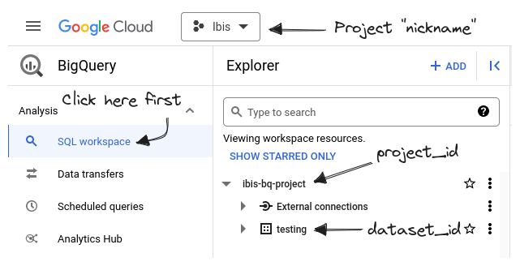



## Install

Install `ibis` and dependencies for the BigQuery backend:

=== "pip"

    ```sh
    pip install 'ibis-framework[bigquery]'
    ```


=== "{{ mgr }}"

    ```sh
    {{ mgr }} install -c conda-forge ibis-bigquery
    ```



## Connect

### `ibis.bigquery.connect`

```python
con = ibis.bigquery.connect(
    project_id="ibis-bq-project",
    dataset_id="testing",
)
```

<!-- prettier-ignore-start -->
!!! info "`ibis.bigquery.connect` is a thin wrapper around [`ibis.backends.bigquery.Backend.do_connect`][ibis.backends.bigquery.Backend.do_connect]."
<!-- prettier-ignore-end -->

### Connection Parameters

<!-- prettier-ignore-start -->
::: ibis.backends.bigquery.Backend.do_connect
    options:
      heading_level: 4
<!-- prettier-ignore-end -->

### `ibis.connect` URL format

In addition to `ibis.bigquery.connect`, you can also connect to BigQuery by
passing a properly formatted BigQuery connection URL to `ibis.connect`

```python
con = ibis.connect(f"bigquery://{project_id}/{dataset_id}")
```

<!-- prettier-ignore-start -->
!!! info "This assumes you have already authenticated via the `gcloud` CLI"
<!-- prettier-ignore-end -->

### Finding your `project_id` and `dataset_id`

Log in to the [Google Cloud Console](https://console.cloud.google.com/bigquery)
to see which `project_id`s and `dataset_id`s are available to use.



### BigQuery Authentication

The simplest way to authenticate with the BigQuery backend is to use [Google's `gcloud` CLI tool](https://cloud.google.com/sdk/docs/install-sdk).

Once you have `gcloud` installed, you can authenticate to BigQuery (and other Google Cloud services) by running

```sh
gcloud auth login
```

For any authentication problems, or information on other ways of authenticating,
see the [`gcloud` CLI authorization
guide](https://cloud.google.com/sdk/docs/authorizing).
