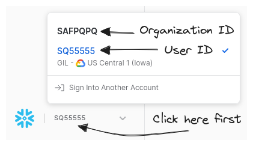
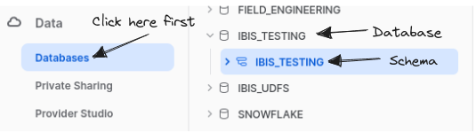

# Snowflake



!!! experimental "Introduced in v4.0"

    The Snowflake backend is experimental and is subject to backwards incompatible changes.

## Install

Install `ibis` and dependencies for the Snowflake backend:

=== "pip"

    ```sh
    pip install 'ibis-framework[snowflake]'
    ```


=== "{{ mgr }}"

    ```sh
    {{ mgr }} install -c conda-forge ibis-snowflake
    ```



## Connect

### `ibis.snowflake.connect`

```python
con = ibis.snowflake.connect(
    user="user",
    password="password",
    account="safpqpq-sq55555",
    database="IBIS_TESTING/IBIS_TESTING",
)
```

<!-- prettier-ignore-start -->
!!! info "`ibis.snowflake.connect` is a thin wrapper around [`ibis.backends.snowflake.Backend.do_connect`][ibis.backends.snowflake.Backend.do_connect]."
<!-- prettier-ignore-end -->

### Connection Parameters

<!-- prettier-ignore-start -->
::: ibis.backends.snowflake.Backend.do_connect
    options:
      heading_level: 4
<!-- prettier-ignore-end -->

### `ibis.connect` URL format

In addition to `ibis.snowflake.connect`, you can also connect to Snowflake by
passing a properly formatted Snowflake connection URL to `ibis.connect`

```python
con = ibis.connect(f"snowflake://{user}:{password}@{account}/{database}")
```

### Authenticating with SSO

Ibis supports connecting to SSO-enabled Snowflake warehouses using the `authenticator` parameter.

You can use it in the explicit-parameters-style or in the URL-style connection
APIs. All values of `authenticator` are supported.

#### Explicit

```python
con = ibis.snowflake.connect(
    user="user",
    account="safpqpq-sq55555",
    database="my_database/my_schema",
    warehouse="my_warehouse",
    authenticator="externalbrowser",
)
```

#### URL

```python
con = ibis.connect(
    f"snowflake://{user}@{account}/{database}?warehouse={warehouse}",
    authenticator="externalbrowser",
)
```

### Looking up your Snowflake organization ID and user ID

A [Snowflake account
identifier](https://docs.snowflake.com/en/user-guide/admin-account-identifier#format-1-preferred-account-name-in-your-organization)
consists of an organization ID and a user ID, separated by a hyphen.

!!! info "This user ID is not the same as the username you log in with."

To find your organization ID and user ID, log in to the Snowflake web app, then
click on the text just to the right of the Snowflake logo (in the
lower-left-hand corner of the screen).

The bold text at the top of the little pop-up window is your organization ID.
The bold blue text with a checkmark next to it is your user ID.



### Choosing a value for `database`

Snowflake refers to a collection of tables as a schema, and a collection of schema as a database.

You must choose a database and a schema to connect to. You can refer to the
available databases and schema in the "Data" sidebar item in the Snowflake web
app.


