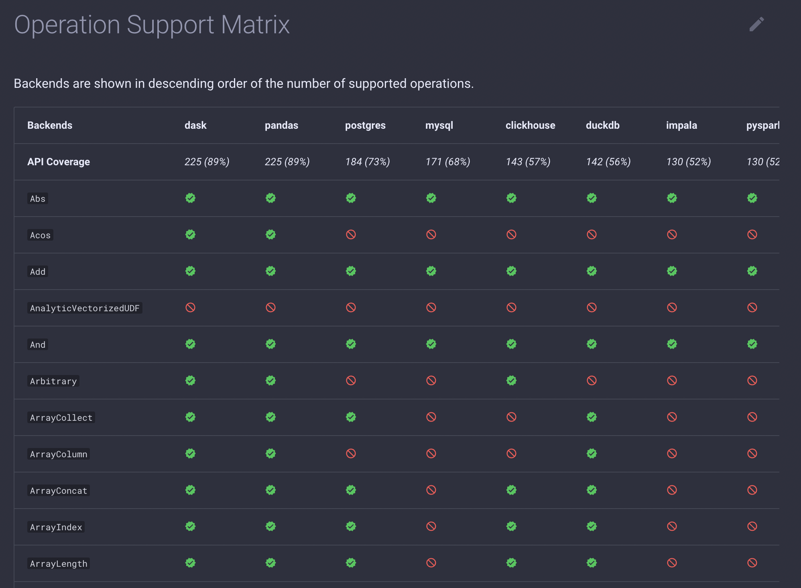
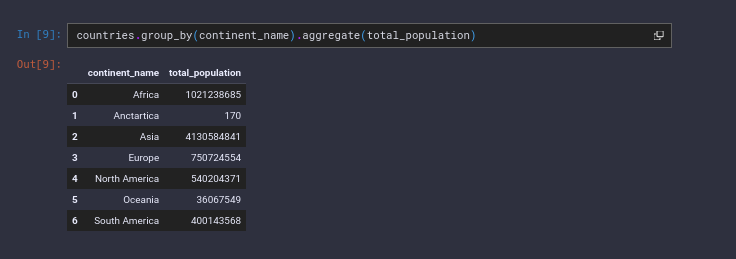

# Ibis v3.0.0

#### by: Marlene Mhangami

The latest version of Ibis, version 3.0.0, has just been released! This post highlights some of the new features, breaking changes, and performance improvements that come with the new release. 3.0.0 is a major release and includes more changes than those listed in this post. A full list of the changes can be found in the project release notes [here](https://ibis-project.org/docs/dev/release_notes/).

## New Features

Aligned to the roadmap and in response to the community’s requests, Ibis 3.0.0 introduces many new features and functionality.

1. Now query an Ibis table using inline SQL
2. _NEW_ DuckDB backend
3. Explore the _NEW_ backend support matrix tool
4. Improved support for arrays and tuples in ClickHouse
5. Suffixes now supported in join API expressions
6. APIs for creating timestamps and dates from component fields
7. Pretty printing in ipython/ notebooks

Refer to the sections below for more detail on each new feature.

### Inline SQL

The most exciting feature of this release is inline SQL! Many data scientists or developers may be familiar with both Python and SQL. However there may be some queries, transformations that they feel comfortable doing in SQL instead of Python. In the updated version of Ibis users can query an Ibis table using SQL! The new .sql method allows users to mix SQL strings with ibis expressions as well as query ibis table expressions in SQL strings.

This functionality currently works for the following backends:

1. PostgreSQL
2. DuckDB
3. PySpark
4. MySQL

If you're interested in adding .sql support for other backends please [open an issue](https://github.com/ibis-project/ibis/issues?page=2&q=is%3Aissue+is%3Aclosed+milestone%3A3.0.0).

### DuckDB Backend

Ibis now supports DuckDB as a backend. DuckDB is a high-performance SQL OLAP database management system. It is designed to be fast, reliable and easy to use and can be embedded. Many Ibis use cases start from getting tables from a single-node backend so directly supporting DuckDB offers a lot of value. As mentioned earlier, the DuckDB backend allows for the new .sql method on tables for mixing sql and Ibis expressions.

### Backend Support Matrix

As the number of backends Ibis supports grows, it can be challenging for users to decide which one best fits their needs. One way to make a more informed decision is for users to find the backend that supports the operations they intend to use. The 3.0.0 release comes with a backend support matrix that allows users to do just that. A screenshot of part of the matrix can be seen below and the full version can be found [here](https://ibis-project.org/docs/dev/backends/support_matrix/).

In addition to this users can now call `ibis.${backend}.has_operation` to find out if a specific operation is supported by a backend.

### Support of arrays and tuples for ClickHouse

The 3.0.0 release includes a slew of important improvements for the ClickHouse backend. Most prominently ibis now supports ClickHouse arrays and tuples.
Some of the related operations that have been implemented are:

- ArrayIndex
- ArrayConcat
- ArrayRepeat
- ArraySlice

Other additional operations now supported for the clickhouse backend are string concat, string slicing, table union, trim, pad and string predicates (LIKE and ILIKE) and all remaining joins.

### Suffixes now supported in join API expressions

In previous versions Ibis' join API did not accept suffixes as a parameter, leaving backends to either use some default value or raise an error at execution time when column names overlapped. In 3.0.0 suffixes are now directly supported in the join API itself. Along with the removal of materialize, ibis now automatically adds a default suffix to any overlapping column names.

### Creating timestamp from component fields

It is now possible to create timestamps directly from component fields. This is now possible using the new method `ibis.date(y,m,d)`. A user can pass in a year, month and day and the result is a datetime object. That is we can assert for example that `ibis.date (2022, 2, 4).type() == dt.date`

### Pretty print tables in ipython notebooks

For users that use jupyter notebooks, `repr_html` has been added for expressions to enable pretty printing tables in the notebook. This is currently only available for interactive mode (currently delegating to pandas implementation) and should help notebooks become more readable. An example of what this looks like can be seen below.

## Breaking Changes

3.0.0 is a major release and according to the project's use of semantic versioning, breaking changes are on the table. The full list of these changes can be found [here](https://ibis-project.org/docs/dev/release_notes/).

1. Python 3.8 is now the minimum supported version
2. Removal of `.materialize()`

Refer to the sections below for more detail on these changes.

### The minimum supported Python version is now Python 3.8

Ibis currently follows [NEP 29](https://numpy.org/neps/nep-0029-deprecation_policy.html), a community policy standard that recommends Python and Numpy versions to support. NEP 29 suggests that all projects across the Scientific Python ecosystem adopt a common “time window-based” policy for support of Python and NumPy versions. Standardizing a recommendation for project support of minimum Python and NumPy versions will improve downstream project planning. As part of the 3.0.0 release, support for Python 3.7 has been dropped and the project has now adopted support for version 3.8 and higher.

### Removal of .materialize()

This release sees the removal of the `.materialize()` method from TableExpr. In the past, the materialize method has caused a lot of confusion. Doing simple things like `t.join(s, t.foo == s.foo).select(["unambiguous_column"])` raised an exception because of it. It turns out that .materialize() isn't necessary and therefore has been removed. This is a breaking change for some code that uses materialize. The materialize method still exists, but is now a pass-through and triggers a warning.

There are also some breaking changes introduced here in the case of overlapping column names. If there are any overlapping column names, a suffix will be attached to both the left and right tables. So, in the case of `s.asof_join(t, "time")` the resulting schema will have both a `time_x` and a `time_y` column.

## Performance Improvements

The following changes to the Ibis codebase have resulted in performance improvements.

1. Speeding up ` __str__` and `__hash__` datatypes
2. Creating a fast path for simple column selection (pandas/dask backends)
3. Global equality cache
4. Removing full tree repr from rule validator error message
5. Speed up attribute access
6. Using assign instead of concat in projections when possible (pandas/dask backends)

Additionally, all TPC-H suite queries can be represented in Ibis. All queries are ready-to-run, using the default substitution parameters as specified by the TPC-H spec. Queries have been added [here](https://github.com/ibis-project/tpc-queries).

## Conclusion

In summary, the 3.0.0 release includes a number of new features including the ability to query an Ibis table using inline SQL, a DuckDB backend, a backend support matrix tool, support for arrays and tuples, suffixes in joins, timestamps from component fields and prettier tables in ipython. Some breaking changes to take note of are the removal of .materialize() and the switch to Python 3.8 as the minimum supported version. A wide range of changes to the code has also led to significant speed ups in 3.0.0 as well.

Ibis is a community led, open source project. If you’d like to contribute to the project check out the contribution guide [here](https://ibis-project.org/docs/dev/contribute/01_environment/). If you run into a problem and would like to submit an issue you can do so through Ibis’ [Github repository](https://github.com/ibis-project/ibis). Finally, Ibis relies on community support to grow and to become successful! You can help promote Ibis by following and sharing the project on [Twitter](https://twitter.com/IbisData), [starring the repo](https://github.com/ibis-project/ibis) or [contributing](https://ibis-project.org/docs/dev/) to the code. Ibis continues to improve with every release. Keep an eye on the blog for updates on the next one!
