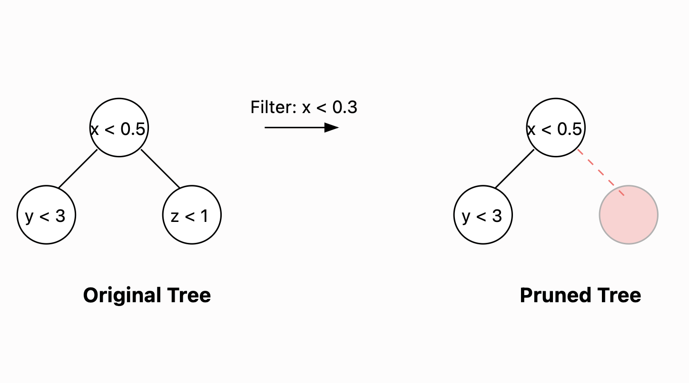

## Introduction

In an ideal world, deploying machine learning models within SQL queries would be as simple as calling a built-in function. Unfortunately, many ML predictions live inside **User-Defined Functions (UDFs)** that traditional SQL optimizers treat as black boxes. This effectively prevents advanced optimizations like predicate pushdown, leading to significant performance overhead when running large-scale inference.

In this blog post, we’ll showcase how you can **prune decision tree models based on query filters** by dynamically rewriting your UDF using **Ibis** and **quickgrove**,an experimental XGBoost inference library built in Rust. We'll also show how [LetSQL](https://github.com/letsql/letsql) can simplify this pattern further and integrate seamlessly into your ML workflows.

---

## The Challenge: ML Models Meet SQL

When you deploy machine learning models (like a gradient-boosted trees model from XGBoost) in a data warehouse, you typically wrap them in a UDF. Something like:

```sql
SELECT
    my_udf_predict(carat, depth, color, clarity, ...)
FROM diamonds
WHERE color_i < 1 AND clarity_vvs2 < 1
```

The problem is that **SQL optimizers don’t know what’s happening inside the UDF**. Even if you filter `color_i < 1`, the full model itself is still evaluated for every row meeting the filter condition. With tree-based models, however, entire branches might never be evaluated at all if they exceed certain thresholds—so the ideal scenario is to prune those unnecessary branches *before* evaluating them.

### Why It Matters

- **Flexible:** Ibis provides a user-facing IR that's transparent and easy to manipulate and rewrite
- **Simple**: Add advanced techniques e.g. predicate pushdowns in your pipeline without having to dive into database internals
- **Performant**: For large datasets (hundreds of millions of rows or more), these optimizations add up quickly.

---

## The Solution: Smart UDFs with Ibis

**Ibis** is known for letting you write queries in Python without losing the power of underlying engines like Spark, DuckDB, or BigQuery. Meanwhile, quickgrove provides a mechanism to prune gradient-boosted decision trees based on known filter conditions for pruning Gradient Boosted Decision Tree (GBDT) models.

**Key Ideas**:

1. **Create UDFs that are predicate-aware** — So we can rewrite them if the upstream query includes filters.
2. **Prune decision trees** — Removing branches that can never be reached, given the known filters.
3. **Inject the pruned model** back into your query plan to skip unnecessary computations.

### Understanding Tree Pruning



Take a simple example: a decision tree that splits on `x < 0.3`. If your query also has a predicate `x < 0.2`, any branches assuming `x >= 0.3` will never be evaluated. By **removing** that branch, the tree becomes smaller and faster to evaluate—especially when you have hundreds of trees (as in many gradient-boosted models).

**Reference**: Check out the [Raven optimizer](https://arxiv.org/pdf/2206.00136) paper. It demonstrates how you can prune nodes in query plans for tree-based inference, so we’re taking a similar approach here for **forests** (GBDTs) using **Ibis.**

---

### Enter quickgrove: Prune-able GBM Models

Quickgrove is an experimental package that can loads XGBoost JSON models and provides a `.prune(...)` API to remove unreachable branches. For example:

```python
#pip install quickgrove
import quickgrove

model = quickgrove.json_load("diamonds_model.json")  # Load an XGBoost model
model.prune([quickgrove.Feature("carat") < 0.2]) # Prune based on known predicate
```

Once pruned, the model is leaner to evaluate but the results heavily depends on the the model and how the predicates interact with the trees within the model.

---

## Scalar PyArrow UDFs in Ibis

::: {.column-margin}
Please note that we are using the DataFusion backend. DataFusion backend and DuckDB backends behave differently in that DuckDB expects a `ChunkedArray` while DataFusion UDFs expect `ArrayRef`. This case needs to be handled if we want the same UDF to run in DuckDB backend.
:::

We’ll define a simple Ibis UDF that calls our `model.predict_arrays` under the hood:

```python
import ibis
import ibis.expr.datatypes as dt

ibis.set_backend("datafusion")
@ibis.udf.scalar.pyarrow
def predict_gbdt(
    carat: dt.float64,
    depth: dt.float64,
    # ... other features ...
) -> dt.float32:
    array_list = [carat, depth, ...]
    return model.predict_arrays(array_list
```

In its default form, `predict_gbdt` is a black box. Now we need Ibis to “understand” it enough to let us swap it out for a pruned version under the right conditions.

---

## Making Ibis Predicate-Aware

Here’s the general process:

1. **Collect predicates** from the user’s filter (e.g. `x < 0.3`).
2. **Prune** the model based on those predicates (removing unreachable tree branches).
3. **Inject** a new UDF that references the pruned model, preserving the rest of the query plan.

### 1. Collecting Predicates

```python
from ibis.expr.operations import Filter, Less, Field, Literal
from typing import List, Dict

def collect_predicates(filter_op: Filter) -> List[dict]:
    """Extract 'column < value' predicates from a Filter operation."""
    predicates = []
    for pred in filter_op.predicates:
        if isinstance(pred, Less) and isinstance(pred.left, Field):
            if isinstance(pred.right, Literal):
                predicates.append({
                    "column": pred.left.name,
                    "op": "Less",
                    "value": pred.right.value
                })
    return predicates
```

### 2. Pruning the Model & Creating a New UDF

```python
import functools
from ibis.expr.operations import ScalarUDF
from ibis.util import FrozenDict

def create_pruned_udf(original_udf, model, predicates):
    """Create a new UDF using the pruned model based on the collected predicates."""
    from quickgrove import Feature

    # Prune the model
    pruned_model = model.prune([
        Feature(pred["column"]) < pred["value"]
        for pred in predicates
        if pred["op"] == "Less" and pred["value"] is not None
    ])
    # For simplicity, let’s assume we know the relevant features or keep them the same.

    def fn_from_arrays(*arrays):
        return pruned_model.predict_arrays(list(arrays))

    # Construct a dynamic UDF class
    meta = {
        "dtype": dt.float32,
        "__input_type__": "pyarrow",
        "__func__": property(lambda self: fn_from_arrays),
        "__config__": FrozenDict(volatility="immutable"),
        "__udf_namespace__": original_udf.__module_
        "__module__": original_udf.__module__,
        "__func_name__": original_udf.__name__ + "_pruned"
    }

    # Create a new ScalarUDF node type on the fly
    node = type(original_udf.__name__ + "_pruned", (ScalarUDF,), {**fields, **meta})

    @functools.wraps(fn_from_arrays)
    def construct(*args, **kwargs):
        return node(*args, **kwargs).to_expr()

    construct.fn = fn_from_arrays
    return construct
```

### 3. Rewriting the Plan

Now we use an Ibis rewrite rule (or a custom function) to **detect filters** on the expression, prune the model, and produce a new project/filter node.

```python
from ibis.expr.operations import Project

def prune_gbdt_model(filter_op, original_udf, model):
    """Rewrite rule to prune GBDT model based on filter predicates."""

    predicates = collect_predicates(filter_op)
    if not predicates:
        # Nothing to prune if no relevant predicates
        return filter_op

    pruned_udf, required_features = create_pruned_udf(original_udf, model, predicates)

    parent_op = filter_op.parent
    # Build a new projection with the pruned UDF
    new_values = {}
    for name, value in parent_op.values.items():
        # If it’s the column that calls the UDF, swap with pruned version
        if name == "prediction":
            # For brevity, assume we pass the same columns to the pruned UDF
            new_values[name] = pruned_udf(value.op().args[0], value.op().args[1])
        else:
            new_values[name] = value

    new_project = Project(parent_op.parent, new_values)

    # Re-add the filter conditions on top
    new_predicates = []
    for pred in filter_op.predicates:
        if isinstance(pred, Less) and isinstance(pred.left, Field):
            new_predicates.append(
                Less(Field(new_project, pred.left.name), pred.right)
            )
        else:
            new_predicates.append(pred)

    return Filter(parent=new_project, predicates=new_predicates)
```

## Diff

The following columns were removes from the function signature since they are no longer required in the pruned version of the mode.

Notice that with pruning we are also able to drop some of the projections in the UDF i.e. `color_i`, `color_j` and `clarity_vvs2`. The underlying engine .e.g. DataFusion may optimize this further when pulling data for UDFs. We cannot completely drop these from the query expression.

```python
- predict_gbdt_3(
+ predict_gbdt_pruned(
    carat, depth, table, x, y, z,
    cut_good, cut_ideal, cut_premium, cut_very_good,
    color_e, color_f, color_g, color_h, color_i, color_j,
    clarity_if, clarity_si1, clarity_si2, clarity_vs1,
-   clarity_vs2, clarity_vvs1, clarity_vvs2
+   clarity_vs2, clarity_vvs1
)
```

> Note: The above is a conceptual example. In a real implementation, you’ll wire this into a full Ibis rewrite pass so it automatically triggers whenever relevant filters are present in your query expression.
>

---

## Putting It All Together

The complete example can be found here: https://github.com/letsql/trusty/blob/main/python/examples/ibis_filter_condition.py

```python
# 1. Load your dataset into Ibis
t = ibis.read_csv("diamonds_data.csv")

expr = (
    t.mutate(prediction=predict_gbdt(t.carat, t.depth, ...))
    .filter(
        (t["clarity_vvs2"] < 1),
        (t["color_i"] < 1),
        (t["color_j"] < 1)
    )
    .select("prediction")
)

# 3. Apply your custom optimization
optimized_expr = prune_gbdt_model(expr.op(), predict_gbdt, model)

# 4. Execute the optimized query
result = optimized_expr.to_expr().execute()
```

When this is done, the model inside `predict_gbdt` will be  **pruned** based on your filter conditions. On large datasets, this can yield significant speedups.

---

## Performance Impact

[Here](https://github.com/letsql/quickgrove/blob/main/python/examples/ibis_filter_condition_bench.py) is the benchmark results ran on Apple M2 Mac Mini, 8 cores / 8GB Memory run with a model trained with 100 trees and depth 6 with following filter conditions:

```
_.carat < 1,
_.clarity_vvs2 < 1,
_.color_i < 1,
_.color_j < 1,
```

Benchmark results:

| File Size | Regular (s) | Optimized (s) | Improvement |
| --- | --- | --- | --- |
| 5M | 0.82 ±0.02 | 0.67 ±0.02 | 18.0% |
| 25M | 4.16 ±0.01 | 3.46 ±0.05 | 16.7% |
| 100M | 16.80 ±0.17 | 14.07 ±0.11 | 16.3% |

**Key takeaway**: As data volume grows, skipping unneeded tree branches can translate to real savings in both time and compute cost, albeit heavily dependent on how pertinent the filter conditions might be.

---

## LetSQL: Simplifying UD(X)Fs

**[LetSQL](https://letsql.com/)) makes advanced UDF rewriting and multi-engine pipelines much simpler. It builds on the same ideas we explored here but wraps them in a higher-level API.

Here’s a quick glimpse of how LetSQL might simplify the pattern:

```python
# pip install letsql

import letsql as ls
from letsql.expr.ml import make_quickgrove_udf, rewrite_quickgrove_expression

model_path = "xgboost_model.json"
predict_udf = make_quickgrove_udf(model_path)

t = ls.memtable(df).mutate(pred=predict_udf.on_expr).filter(ls._.carat < 1)
optimized_t = rewrite_quickgrove_expression(t)

result = ls.execute(optimized_t)
```

With LetSQL, you get a **shorter, more declarative approach** to the same optimization logic we manually coded with Ibis. It abstracts away the gritty parts of rewriting your query plan.

---

## Best Practices & Considerations

- **Predicate Types**: Currently, we demonstrated `column < value` logic. You can extend it to handle `<=`, `>`, `BETWEEN`, or even categorical splits.
- Quickgrove only supports a handful of objective functions and most notably does not have categorical support yet. In theory, categorical variables make a better candidates for pruning based on filter conditions.
- **Model Format**: XGBoost JSON is straightforward to parse. Other formats (e.g. LightGBM, scikit-learn trees) require similar logic or conversion steps.
- **Edge Cases**: If the filter references columns not in the model features, or if multiple filters combine in more complex ways, your rewriting logic may need more robust parsing.
- **When to Use**: This approach is beneficial when queries often filter on the same columns your trees split on. For purely ad-hoc queries or rarely used filters, the overhead of rewriting might outweigh the benefit.

---

## Conclusion

Combining **Ibis** with a prune-friendly framework like quickgrove lets you automatically optimize large-scale ML inference inside SQL queries. By **pushing filter predicates down into your decision trees**, you skip unnecessary computations and speed up queries significantly.

**And with LetSQL**, you can streamline this entire process—especially if you’re looking for an out-of-the-box solution that integrates with multiple engines and query languages. As next steps, consider experimenting with more complex models, exploring different tree pruning strategies, or even extending this pattern to other ML models beyond GBDTs.

- **Try it out**: Explore the Ibis documentation to learn how to build custom UDFs.
- **Dive deeper**: Check out [quickgrove](https://github.com/letsql/trusty) or read the Raven optimizer [paper](https://arxiv.org/pdf/2206.00136).
- **Experiment with LetSQL**: If you need a polished  solution for dynamic ML UDF rewriting, [LetSQL](https://github.com/letsql/letsql) may be just the ticket.

---

## Resources

- **Paper**: [End-to-end Optimization of Machine Learning Prediction Queries (Raven)](https://arxiv.org/pdf/2206.00136)
- **Ibis + Torch**: [Ibis Project Blog Post](https://ibis-project.org/posts/torch/)
- **quickgrove**: [GitHub Repository](https://github.com/letsql/quickgrove)
- **LetSQL**: [Documentation](https://docs.letsql.com)
